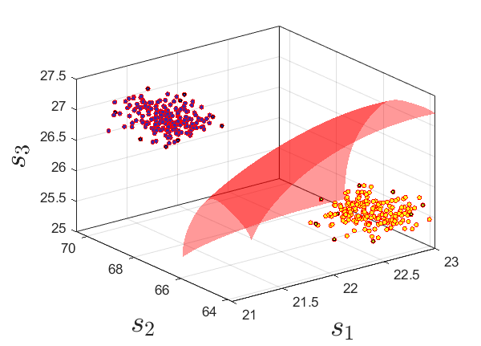
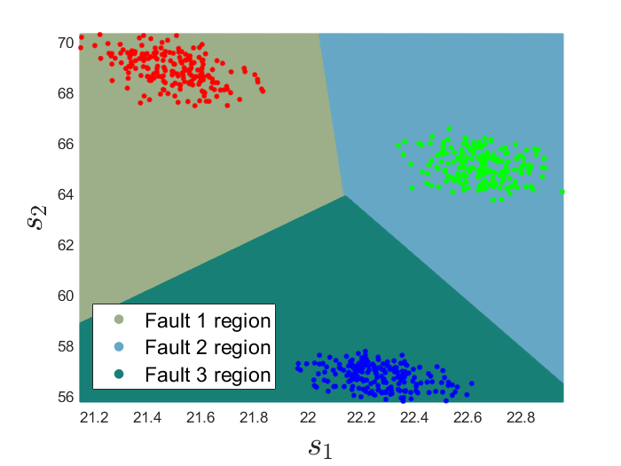

# Project Title

A Data-Driven Approach for High-Impedance Fault Localization in Distribution Systems


## Appendix

https://arxiv.org/abs/2311.15168


## Usage

```javascript
# Pick some high impedance fault data for classification
file_paths = ['IEEE123_PV_L1C1B5HIF.csv', 'IEEE123_PV_L1C1B34HIF.csv', 'IEEE123_PV_L1C1B45HIF.csv']
```

The high impedance fault (HIF) data for the IEEE 123-bus system can be downloaded from [here](https://github.com/yuqingdong0/Transient-Data-for-OEDI/tree/main/Simulation%20Data/IEEE%20123/Faults/High%20Impedance%20Fault). 

The user can select the HIF data from a few locations for the classification. The algorithm first processes the data and apply piecewise linear approximation to the voltage-current trajectory. Following that, the simplified function features are collected as inputs and SVM is utilized for the HIF identification.

When SVM is used for the HIF identification task, the learning output is the fault location label (e.g., bus number), and we propose utilizing the features from the approximation functions as the input. Specifically, for the piecewise linear approximation, the SVM input can be constructed as:

```math
x_{\mathcal{L}} = \{s_1, s_2, s_3\}
```
which consists of slope rates for all segments in the piecewise linear function.

Since quadratic functions contain more information than linear functions, SVM inputs under quadratic approximation will be lifted to a higher-dimensional space:

```math
x_{\mathcal{Q}} = \{(m_1,n_1),(m_2,n_2),(m_3,n_3)\}
```

which include both quadratic and linear coefficients for each piece of the function.


## Examples

The performance of the piecewise approximation and SVM algorithm for HIF identification tasks can be validated using the IEEE 123-node test feeder. The test feeder is simulated in EMTP-ATP (ElectroMagnetic Transients Program, version Alternative Transients Program) with 14 rooftop photovoltaic (PV) units incorporated. In this model, the loading condition (`{0.4, 1.0}` per unit) and PV capacity (`{0.4, 0.6, 0.8, 1.0}` per unit) are varied for different steady-state scenarios. The HIF simulations span across 66 locations in total, with 63 internal nodes as well as 3 adjacent nodes outside the feeder.


The classification of two faults at buses 7 and 64 using the Gaussian kernel as an example is shown below:
<p align="center">
  
</p>
where the hyperplane in red distinctly classifies these two faults using the slope rates of V-I trajectories. For the SVM under multiple HIFs, we can project the input to a two-dimensional space by keeping only two slope rates (*s*<sub>1</sub> and *s*<sub>2</sub>). The performance of SVM with a linear kernel on three different HIFs is demonstrated below: 
<p align="center">
  
</p>
These faults are simulated at buses 7, 64, and 82, respectively. Because they are located in different areas of the system, even with partial inputs, the linear SVM can efficiently identify these HIFs.


